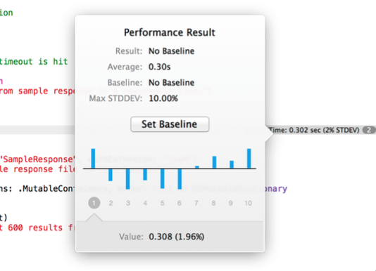
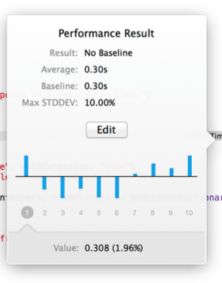
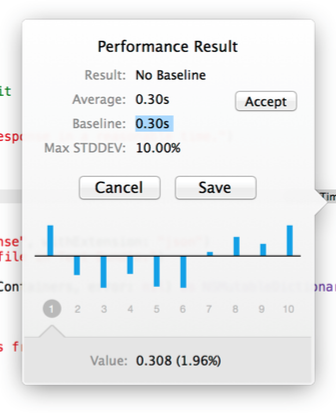
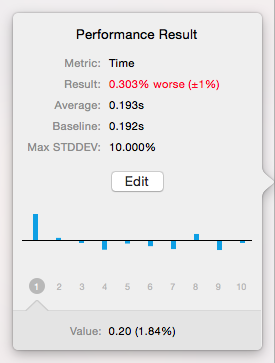
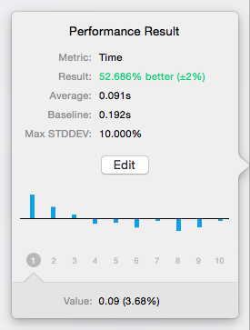

# Asynchronous And Performance Testing

iOS 8 增加了对异步测试和性能测试的支持。

## 异步测试

```swift
func test_async_fetchPlaces() {
	// 创建用于异步测试的 XCTestExpectation 实例.
	let expectation = expectationWithDescription("我是描述...") 

	// 测试某个异步方法.
	myObject.doSomethingAsyncWithCompletion {

		// ...
		
		// 异步任务完成后,标记测试完成.
		expectation.fulfill();
	}

	// 设置超时时间为 1s. 如果到达超时时间或者测试被标记完成,此闭包会被调用.
	waitForExpectationsWithTimeout(1.0) { error in 
		XCTAssertNil(error, "异步任务在超时前没有完成."); 
	}
}
```

## 性能测试

```swift
func test_performance_myFunction() {
	measureBlock {
		myObject.myFunction() // 在这里执行要测试性能的方法.
	}
}
```

被测试的方法会进行十次采样，可以点击灰色的提示查看，如下图所示：



这些小蓝条表示当次花费时间相对平均时间的偏移，`Value`值具体反映了当次花费的时间。

点击`Set Baseline`按钮可将平均时间`Average`设置为基线时间`Baseline`，如下图所示：



进一步点击`Edit`按钮还可以对`Baseline`和`Max STDDEV`（最大标准差）进行编辑：



点击`Accept`按钮可将`Baseline`重置为`Average`。

设置了`Baseline`后，再次执行测试时，就会将花费时间与之比较，结果会像下图这样：

更慢了 | 更快了
--- | ---
 | 

另外，还可以使用下面这个方法进行测试，优点是可以在每次迭代开始前和结束后执行额外代码。

```swift
measureMetrics([XCTPerformanceMetric_WallClockTime], automaticallyStartMeasuring: false) {
    // 在开始前进行准备工作,由于在 startMeasuring() 之前,执行该部分代码不会算入性能测试之中.
    self.startMeasuring() // 本次测试开始.
	myObject.myFunction() // 在这里执行要测试性能的方法.
    self.stopMeasuring()  // 本次测试结束.
    // 在每次迭代结束后进行清理工作,由于在 stopMeasuring() 之后,执行该部分代码不会算入性能测试之中.
}
```

`[XCTPerformanceMetric_WallClockTime]`用于指定一些测试指标，目前 Apple 只提供了这一个。

使用`measureBlock(:_)`方法时，其采用的测试指标为`defaultPerformanceMetrics()`方法返回的值，也就是`[XCTPerformanceMetric_WallClockTime]`。等未来有其他指标可供选择时，子类可以重写此方法返回其他指标。

另外，`automaticallyStartMeasuring`参数一定要设置为`false`，否则和`measureBlock(:_)`方法效果一样了。

## 其他

单元测试有时可能需要加载一些专门供测试的本地资源，通常应该将这些资源放在单元测试的文件夹下。

这就意味着需要从单元测试 target 的 bundle 中加载这些资源，而非 main bundle 中。

为了方便获取 bundle，可以像下面这样定义一个`NSBundle`的扩展：

```swift
class Dummy { /* 将该类定义在单元测试 target 下. */ }

extension NSBundle {
    class func testBundle() -> NSBundle {
        /*	此方法返回类所在的 farmwork 的 bundle.
        	由于 Dummy 定义在单元测试 target 下, 因此会返回单元测试 target 的 bundle. */
        return NSBundle(forClass: Dummy.self)
    }
}
```
