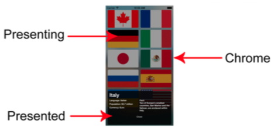

# 定制 UIPresentationController 子类

- [presentingViewController 和 presentedViewController](#presented_and_presenting_controllers)
- [定制 UIPresentationController 子类](#subclassing_UIPresentationController)

<a name="presented_and_presenting_controllers"></a>
## presentingViewController 和 presentedViewController

`presentingViewController` 和 `presentedViewController` 并非新概念，它们在 `iOS 5` 引入，作为 `UIViewController` 的两个属性。前者表示被呈现的视图控制器，后者表示持有被呈现的视图控制器的视图控制器。

`iOS 8` 新引入了 `UIPresentationController`，它也有上述两个属性，这样操作视图控制器会更为方便。注意该类继承自 `NSObject`，而并非 `UIViewController`。

下图展示了 `presentingViewController` 和 `presentedViewController` 的关系：


`Presenting` 即背后的设置界面的视图控制器，`Chrome` 是介于 `presentingViewController` 和 `presentedViewController` 之间的视图，通常是这种半透明的样子。

<a name="subclassing_UIPresentationController"></a>
## 定制 UIPresentationController 子类

通过定制 `UIPresentationController` 子类，可以轻松实现下图这样的效果：



### 核心方法

主要需要实现下面四个方法：

```swift
func presentationTransitionWillBegin()
func presentationTransitionDidEnd(completed: Bool)
func dismissalTransitionWillBegin()
func dismissalTransitionDidEnd(completed: Bool)
```

首先，通常会在 `presentationTransitionWillBegin()` 方法中将自定义的视图添加到 `UIPresentationController` 的 `containerView` 上。`containerView` 是 `presentingViewController` 和 `presentedViewController` 的视图的共同父视图，而不是 `UIPresentationController` 的视图，`UIPresentationController` 继承自 `NSObject`，并不是一个视图控制器。

然后利用 `presentedViewController` 的 `transitionCoordinator` 为自定义视图添加动画效果，这些动画会和 `UIKit` 的 `presentation` 动画一起执行（例如一个 `modal` 过程的动画）。

```swift
override func presentationTransitionWillBegin() {

    // 添加自定义的模糊视图到视图层级底层，确保在 presentedViewController 的视图之下
    dimmingView.frame = containerView!.bounds
    containerView!.insertSubview(dimmingView, atIndex: 0)

    // 获取 presentedViewController 的 transitionCoordinator，用它来执行自定义视图的动画
    // 这里设置了一个淡入动画
    dimmingView.alpha = 0
    presentedViewController.transitionCoordinator()!.animateAlongsideTransition({ _ in
        self.dimmingView.alpha = 1
    }, completion: nil)
}
```

在 `presentation` 动画结束后，可以选择在 `presentationTransitionDidEnd(_:)` 方法中进行一些清理工作。这主要针对手势驱动的 `presentation` 动画，因为用户可能会中途取消操作，那么这时候就需要将自定义视图从视图层级移除，恢复先前的样子。

```swift
override func presentationTransitionDidEnd(completed: Bool) {
    // 如果是手势驱动的，那么用户可能会中途终止，此时 completed 会为 false，此时应该将自定义视图移除
    if !completed {
        dimmingView.removeFromSuperview()
    }
}
```

针对 `dismissal` 过程，需要实现下面这个方法。和 `presentation` 过程类似，在这里为自定义视图添加动画。

```swift
override func dismissalTransitionWillBegin() {
    presentedViewController.transitionCoordinator()!.animateAlongsideTransition({ _ in
        self.dimmingView.alpha = 0
    }, completion: nil)
}
```

同样，可以选择在 `dismissal` 过程结束后进行一些清理工作。

```swift
override func dismissalTransitionDidEnd(completed: Bool) {
    // completed 为 true 表示完全 dismiss 而没有中途取消，此时应移除自定义视图，否则应该恢复 dismiss 前的样子
    if completed {
        dimmingView.removeFromSuperview()
    }
}
```

如果过渡动画不是手势驱动的，只实现 `presentationTransitionWillBegin()` 和 `dismissalTransitionWillBegin()` 就可以了。

### 布局调整

设备旋转时，`viewWillTransitionToSize(_:withTransitionCoordinator:)` 方法就会调用，因为 `UIPresentationController` 符合 `UIContentContainer` 协议。可以在此方法中对自定义视图进行布局调整，也可以在 `containerViewWillLayoutSubviews()` 方法中处理，此方法和 `UIViewController` 的 `viewWillLayoutSubviews` 类似。

```swift
override func containerViewWillLayoutSubviews() {
    // 设备旋转时，重新调整添加的自定义视图，使之依旧能和父视图重合
    dimmingView.frame = containerView!.bounds
}
```

如果想改变 `presentedViewController` 的视图的 `frame`，可以实现如下方法。默认情况下该方法会返回 `containerView` 的 `frame`。此方法会多次调用，因此一定要返回同一个 `frame`，也不要在此方法中执行应该只执行一次的任务。

```swift
override func frameOfPresentedViewInContainerView() -> CGRect {
    return /* 返回需要的 frame */
}
```

还可以通过 `overrideTraitCollection` 属性来覆盖 `presentedViewController` 的 `traitCollection`，这只会覆盖指定的值。例如，通过 `init(horizontalSizeClass:)` 创建了一个 `UITraitCollection`，那么 `presentedViewController` 的 `traitCollection` 只会被覆盖掉 `horizontalSizeClass`。

### 其他

可以实现 `shouldRemovePresentersView()` 方法决定是否移除 `presentingViewController`，默认为 `false`。对于上图中那种半透明的背景，如果移除了 `presentingViewController`，后面就会变成黑色了。

### 使用示例

使用方法如下：

```swift
let presentedViewController = /* ... */
presentedViewController.modalPresentationStyle = .Custom // 设置风格为 Custom
presentedViewController.transitioningDelegate = self     // 利用代理返回自定义的 UIPresentationController 子类
presentViewController(presentedViewController, animated: true, completion: nil)
```

代理需符合 `UIViewControllerTransitioningDelegate` 协议，并在下面的代理方法中返回自定义的 `UIPresentationController` 子类：

```swift
func presentationControllerForPresentedViewController(presented: UIViewController,
    presentingViewController presenting: UIViewController,
    sourceViewController source: UIViewController) -> UIPresentationController? {
    return CustomPresentationController(presentedViewController: presented, presentingViewController: presenting)
}
```

更复杂的用法是配合 `UIViewControllerTransitioningDelegate` 协议中的其他代理方法，提供实现 `UIViewControllerAnimatedTransitioning` 协议的动画对象，从而定制动画过程，甚至支持手势交互，这些代理方法在 `iOS 7` 就引入了。
