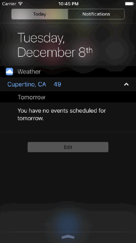
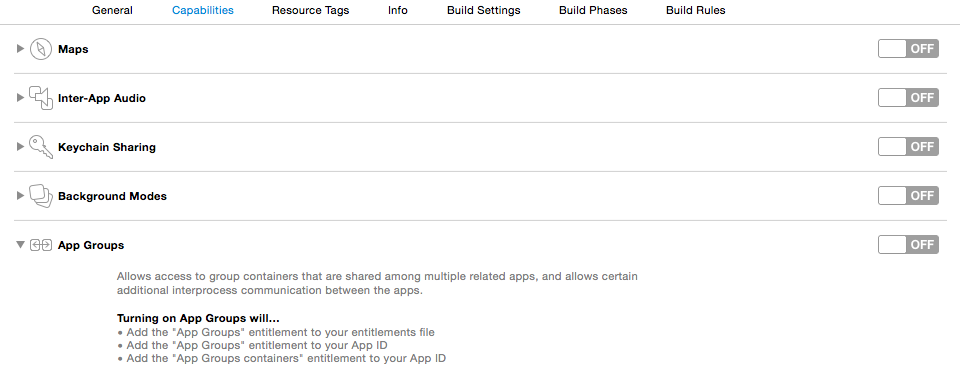
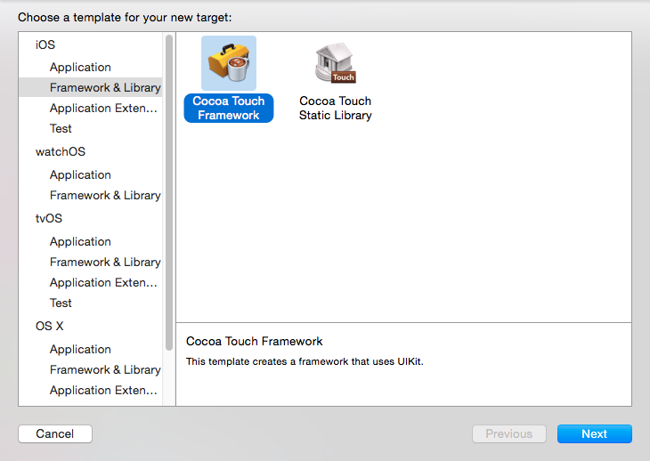
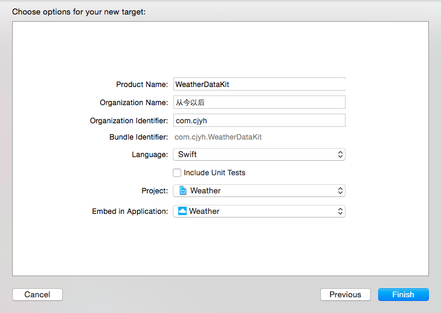
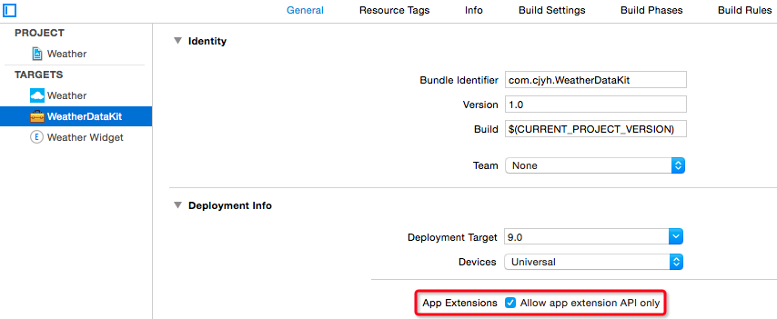
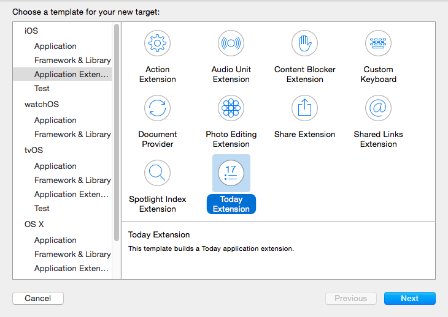
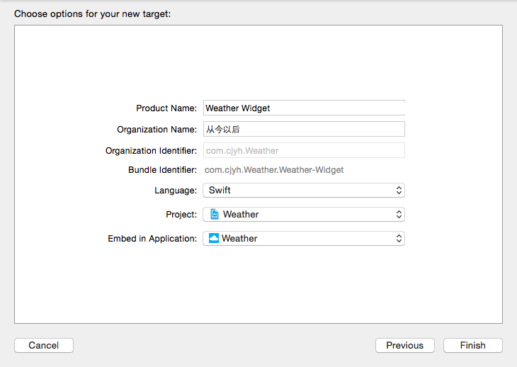
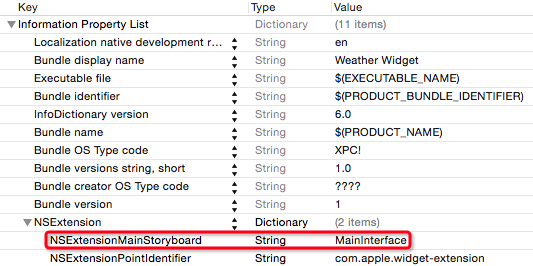
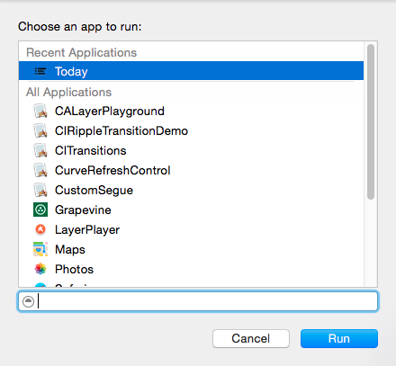
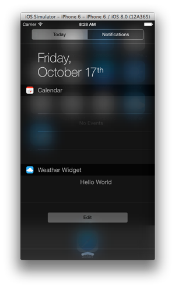

# Today Extension



## 应用扩展基本概念

应用扩展虽然是个独立的 target，但是不能独立于应用程序，无论是开发还是发布，都需要依附于一个主体应用程序（可称之为容器应用）。

应用扩展在运行时是个独立的进程，不依赖其容器应用，也不依赖于其他使用此扩展的应用（可称之为宿主应用）。同一应用扩展可以同时运行多个进程，从而服务于不同的宿主应用。即使容器应用没有运行，应用扩展也可以使用；或者，即使宿主应用已经退出，为宿主应用服务的应用扩展仍可根据需要继续运行。

应用扩展无法与容器应用直接通信，也无法与宿主应用直接通信。相应的，容器应用和宿主应用也无法通信。不过，当宿主应用使用应用扩展时，会传递一个 `NSExtensionContext` 对象，应用扩展可以通过该对象的 `openURL(_:completionHandler:)` 方法打开容器应用；应用扩展还可以通过共享的存储，例如 `NSUserDefaults`，来和容器应用共享数据。

使用 `NSUserDefaults` 进行数据共享时，需在容器应用和应用扩展中设置 `App Groups`，如下图所示：



这里需要指定容器应用的 `Bundle Identifier`，例如容器应用的 `Bundle Identifier` 是 `com.cjyh.Weather`，那么这里的标注需指定为 `group.com.cjyh.weather`。

之后，在容器应用和应用扩展中用如下方式创建 `NSUserDefaults` 对象，就可以共享数据了：

```swift
NSUserDefaults(suiteName: "group.com.cjyh.weather")
```

## 使用内嵌框架共享代码

由于应用扩展是个独立的 target，无法访问主程序 target 中的代码，为了避免代码重复，最好将可复用的代码单独封装为一个内嵌框架。

如下图所示，在工程中新建一个框架的 target：




需要注意，应用扩展无法使用某些 Cocoa Touch 的 API，限制如下：

- 无法访问 `sharedApplication` 对象，因此也就无法使用该对象的任何方法
- 无法使用标记 `NS_EXTENSION_UNAVAILABLE` 宏的 API，甚至无法使用某些框架。例如，`HealthKit` 和 `EventKit` 框架。
- 无法使用 iOS 设备上的摄像头和麦克风
- 无法长时间运行后台任务
- 无法使用 AirDrop 接收数据，但是可以发送数据

为了能安全地使用 API，可勾选如下选项，在非法使用 API 时获得编译器的提醒：



## 创建 Today Extension

如下图所示，在工程中新建 target，选择 `Today Extension`：




点击 `Finish` 后会弹出个对话框，询问是否激活扩展的 `Scheme`，点击激活即可。

创建 target 后，可以发现工程目录下多了扩展的文件夹，如下图所示：


Xcode 自动提供了一个 `Storyboard`，之后就在这里进行界面设计即可，如果想修改，可以到 `Info.plist` 中的如下字段中另行指定：



进入 `MainInterface.storyboard`，将如下所示：


此时点击运行，会弹出个对话框，要求选取一个宿主应用，如下所示：



选择 `Today` 即可，运行后效果如下：



进入 `TodayViewController.swift` 文件，可以看到这就是平常的视图控制器，此时就可以像平常一样编写代码了。需要注意的是，控制器的视图在 `Today` 中的大小可自行调整，建议根据内容使用自动布局来确定视图大小。

另外，该视图控制器还采纳了 `NCWidgetProviding` 协议。该协议只有两个方法，如下所示：

```swift
func widgetPerformUpdateWithCompletionHandler(completionHandler: ((NCUpdateResult) -> Void)) {
    /*  Xcode 已提供了此代理方法的默认实现。系统会定期调用此方法，
        可以在这里根据需要异步更新展示的数据，完成后调用闭包，并传入 .NewData。
        另外还有 .NoData 和 .Failed 选项。 */
    completionHandler(.NewData)
}

func widgetMarginInsetsForProposedMarginInsets(defaultMarginInsets: UIEdgeInsets) -> UIEdgeInsets {
    // 注意上图的 “Hello World” 是偏右的，实现此代理方法可进行相应调整
    return UIEdgeInsets() 
}
```