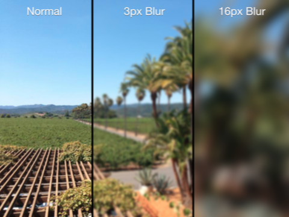

# Visual Effects

## 图片模糊原理介绍

为了生成模糊图片，需根据一定的模糊算法对图片每个像素的颜色值进行计算，将结果作为像素模糊后的颜色值。

模糊算法有不同的风格和复杂性，在本 demo 中将使用高斯（Gaussian）模糊算法。

最简单模糊的过程即是用某个像素周围像素的颜色平均值作为该像素模糊后的颜色值。

如下图所示。当然这里为了简化使用整数演示颜色值。

模糊前 | 模糊后
-|-
 | 

模糊前，中心像素的值为`6`，周围相邻像素的值的和为`39`。

模糊后，中心像素的值为`39 / 8 = 4.875`，约等于`4.9`。

按照这样的算法，对图片每个像素进行处理，就得出了模糊后的图片。

上述算法仅计算了中心像素周围相邻的像素，如果扩大模糊半径，例如将各方向上 3 个像素像素纳入计算范围，则会增大模糊的效果。

如下图所示：

通常来说，模糊半径越大，参与计算的像素就越多，因此计算带来的性能消耗就越大。