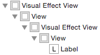
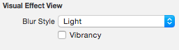

# Visual Effects

## 图片模糊原理介绍

为了生成模糊图片，需根据一定的模糊算法对图片每个像素的颜色值进行计算，将结果作为像素模糊后的颜色值。

模糊算法有不同的风格和复杂性，在本 demo 中将使用高斯（Gaussian）模糊算法。

最简单模糊的过程即是用某个像素周围像素的颜色平均值作为该像素模糊后的颜色值。

如下图所示。当然这里为了简化使用整数演示颜色值。

模糊前 | 模糊后
---|---
 | 

模糊前，中心像素的值为`6`，周围相邻像素的值的和为`39`。

模糊后，中心像素的值为`39 / 8 = 4.875`，约等于`4.9`。

按照这样的算法，对图片每个像素进行处理，就得出了模糊后的图片。

上述算法仅计算了中心像素周围相邻的像素，如果扩大模糊半径，例如将各方向上 3 个像素纳入计算范围，则会增大模糊的效果。

如下图所示：


通常来说，模糊半径越大，参与计算的像素就越多，计算带来的性能消耗就越大。

## UIVisualEffectView

iOS 8 推出了`UIVisualEffectView`，可以轻松实现模糊效果，再也不用借助第三方框架了。

其初始化方法如下所示：

```swift
public init(effect: UIVisualEffect?)
```

`UIVisualEffect`是个抽象基类，有两个子类，`UIBlurEffect`和`UIVibrancyEffect`。

#### UIBlurEffect

`UIBlurEffect`用于提供普通的模糊效果，接口非常简单，只有构造器：

```swift
public class UIBlurEffect : UIVisualEffect {
    public /*not inherited*/ init(style: UIBlurEffectStyle)
}
```

有三种模糊风格可供选择：

```swift
public enum UIBlurEffectStyle : Int {
    case ExtraLight
    case Light
    case Dark
}
```

#### UIVibrancyEffect

`UIVibrancyEffect`需要和`UIBlurEffect`相配合，接口也是只有构造器：

```swift
public class UIVibrancyEffect : UIVisualEffect {
    public /*not inherited*/ init(forBlurEffect blurEffect: UIBlurEffect)
}
```

另外，`UIVibrancyEffect`通过扩展提供了一个类方法，可获得通知中心那种模糊效果：

```swift
extension UIVibrancyEffect {
    public class func notificationCenterVibrancyEffect() -> UIVibrancyEffect
}
```

使用时需要导入相应模块：

```swift
import NotificationCenter
```

#### 效果展示

`UIBlurEffect`和`UIVibrancyEffect`经过组合，会有六种效果，如下图所示：


#### 使用方法

`UIBlurEffect`使用起来非常简单：

```swift
// 指定一种模糊风格.
let blurEffect = UIBlurEffect(style: .Light) 
// 用 UIBlurEffect 创建 UIVisualEffectView.
let visualEffectView = UIVisualEffectView(effect: blurEffect) 
```

视图层级上位于`visualEffectView`下层的视图就会产生模糊效果。

如果想往`UIVisualEffectView`上添加子视图，不要直接添加，需添加到它的`contentView`上。

`UIVibrancyEffect`使用起来有些麻烦：

```swift
// 首先需要创建一个 UIBlurEffect 对象.
let blurEffect = UIBlurEffect(style: .Light) 
// 然后使用该 UIBlurEffect 创建一个 UIVisualEffectView 对象.
let blurEffectView = UIVisualEffectView(effect: blurEffect)
// 接着使用同一个 UIBlurEffect 对象创建一个 UIVibrancyEffect 对象.
let vibrancyEffect = UIVibrancyEffect(forBlurEffect: blurEffect)
// 再使用 UIVibrancyEffect 对象创建一个 UIVisualEffectView 对象.
let vibrancyEffectView = UIVisualEffectView(effect: vibrancyEffect)
// 最后将 vibrancyEffectView 添加到 blurEffectView 的 contentView 上.
blurEffectView.contentView.addSubview(vibrancyEffectView)
```

和单独使用`UIBlurEffect`时类似，`blurEffectView`下层的视图会产生模糊效果。

配合`UIVibrancyEffect`的效果在于，如果将一些视图，例如一个`UILabel`添加到`vibrancyEffectView`的`contentView`上，这个子视图会有种突出显示的效果。

如果使用 IB，则会方便的多。

单独使用`UIBlurEffect`效果时，直接从列表里拖一个`Visual Effect View with Blur`对象出来即可。如果需要添加子视图，直接添加到它的子视图`View`上即可。

其层级结构如下图所示：

![])(./Screenshot/VisualEffectViewWithBlur.png)

配合`UIVibrancyEffect`效果使用时，拖一个`Visual Effect Views with Blur and Vibrancy`对象出来，将子视图添加到最上层的`View`上即可。

其层级结构如下图所示：



选择模糊风格时，可在 Attributes Inspector 中进行选择：



注意，配合`UIVibrancyEffect`效果使用时，两个`UIVisualEffectView`的模糊风格需要相同。而且，上层的`UIVisualEffectView`需要勾选`Vibrancy`，以此表明它是使用`UIVibrancyEffect`创建的。同样道理，使用`UIBlurEffect`的`UIVisualEffectView`不要勾选`Vibrancy`。实际使用中，不要更改 IB 中的默认设置就可以了。

#### 注意事项

`UIVisualEffectView`以及父视图的`alpha`需要为`1.0`，否则会因为大量额外的像素合成带来很大的性能问题，甚至可能无法正确呈现模糊效果。

对`UIVisualEffectView`设置`mask`时，它会将`mask`视图进行 copy，
